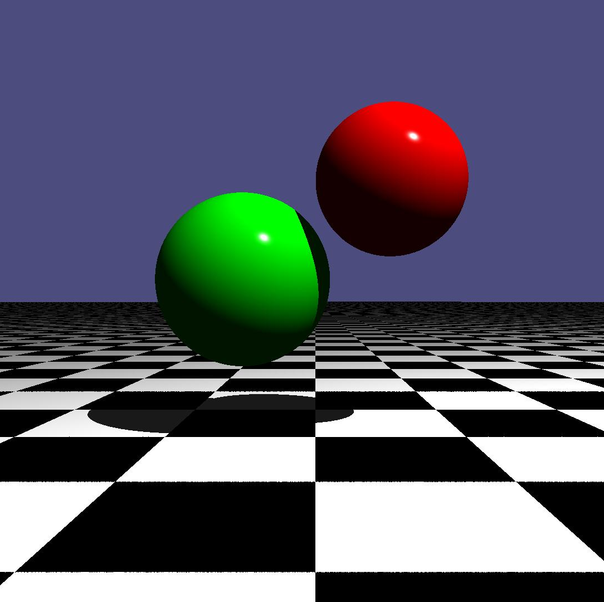

**This is a program for rendering basic 3D shapes using ray tracing in C++.**  
 
The program reads in a text file continaing formatted information about the color and position of the shapes and light source, and creates a linked list using C++ pointers. It then uses ray tracing to render each object in space and perform realistic lighting calculations based on the position of the light source.    

## The final image produced by running the program with dimensions 1920 x 1080
